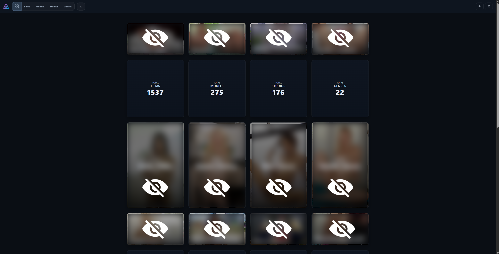
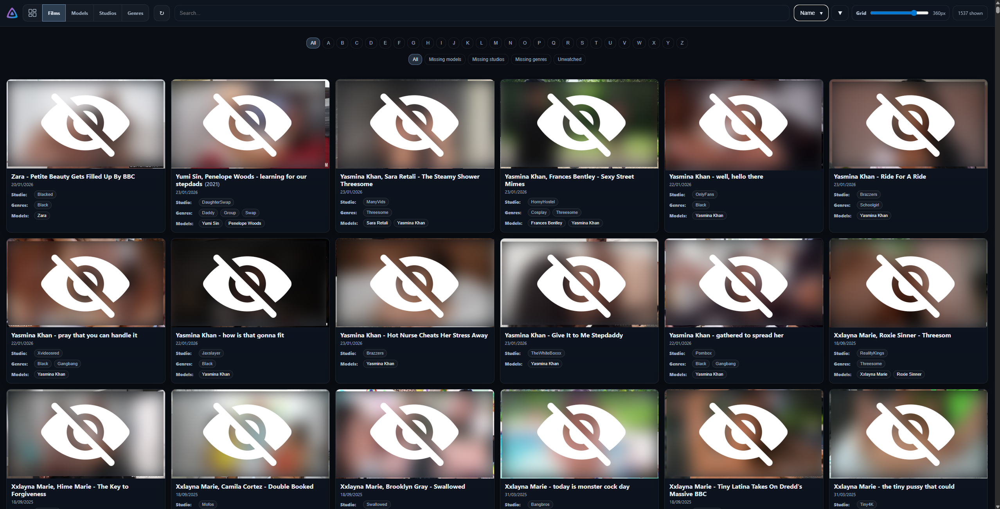
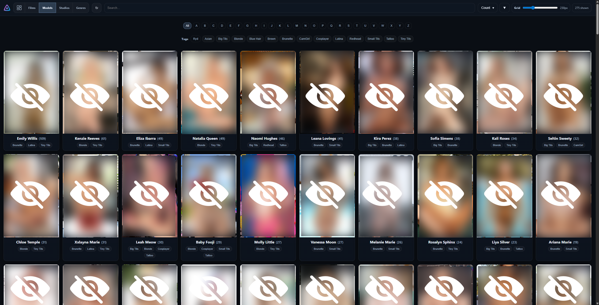
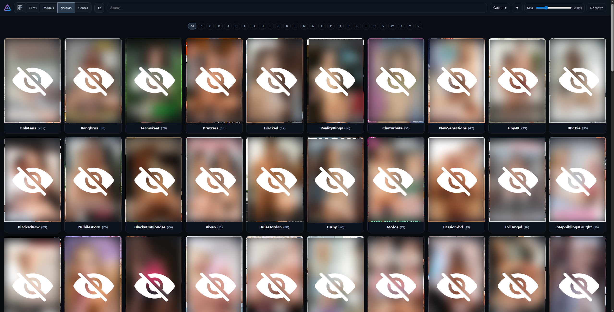
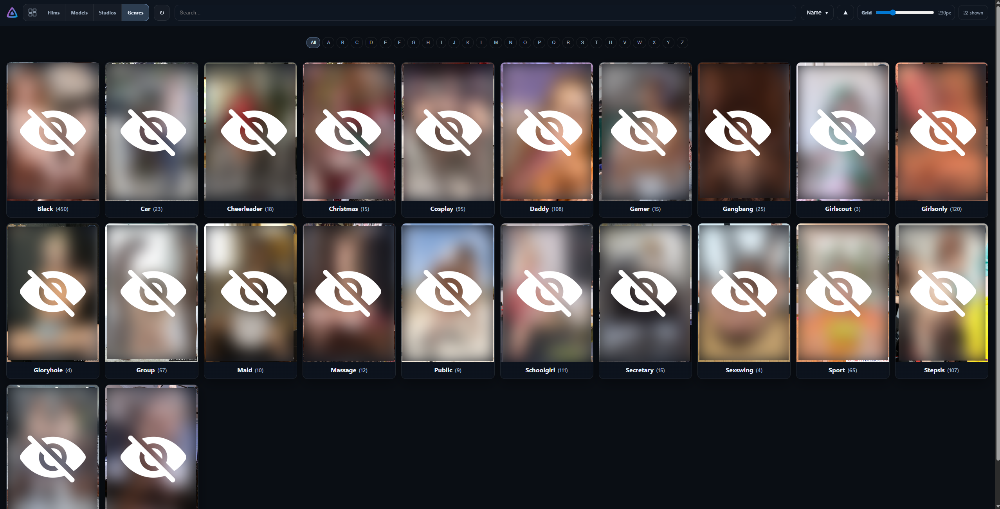

# Server Shell for Jellyfin

Local, personal Jellyfin dashboard that builds static HTML pages for:
- Films
- Models (Jellyfin Persons)
- Studios
- Genres
- Dashboard summary

## Purpose

This project started because I use Jellyfin for adult content that does not match online databases, so I maintain manual metadata for each film. Jellyfin does not provide a way to list all the people I have added across my library, so I built a local tool to generate that overview for myself. It evolved into something I’m happy with, so I’m publishing it for others to use.

Important: This project is built around adult content (porn).

## Screenshots







## Quick start (Windows)

1) Create venv and install deps:

```
py -m venv .venv
.venv\Scripts\activate
pip install -r requirements.txt
```

Or use the helper script:

```
setup.bat
```

2) Create your local config:

```
copy gm\config_local.example.py gm\config_local.py
```

Edit `gm\config_local.py` and fill in:
- `JELLYFIN_URL`
- `USERNAME`
- `PASSWORD`
- `SERVER_ID`

3) Generate pages:

```
python -m gm.generate_models_html
```

4) Start the local server:

```
python server.py
```

Or use:

```
start_server.bat
```

Open:

```
http://127.0.0.1:8787/
```

## Optional: change host/port

You can override the server host/port with environment variables:

```
set MODEL_LIST_HOST=127.0.0.1
set MODEL_LIST_PORT=8787
python server.py
```

## Notes

- Your local config lives in `gm\config_local.py` and is ignored by git.
- Generated HTML lives in `gm\*.html` and is ignored by git.
- Refresh button in the UI runs the generator and reloads the page.

## Troubleshooting

- If login fails, verify Jellyfin URL/username/password.
- If server links look wrong, verify `SERVER_ID`.

